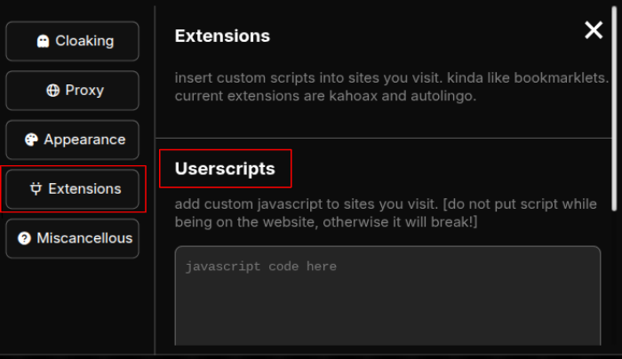
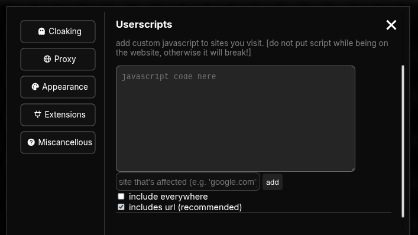
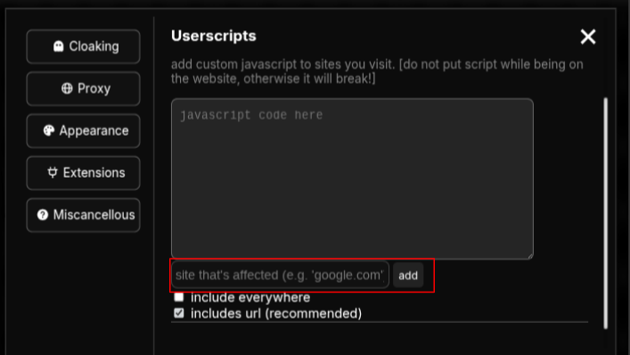
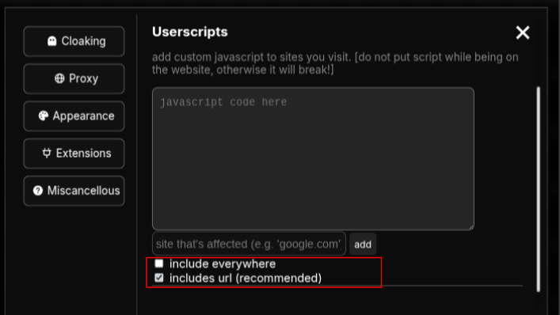
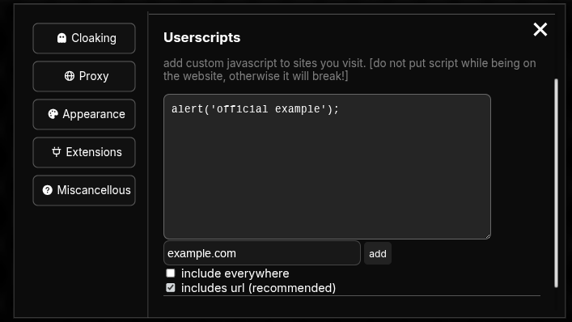
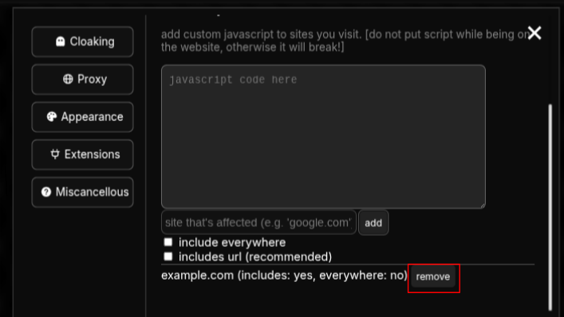

<h1 align="center"></h1>
<h1 align="center">wiki.</h1>
<p align="center">a guide on using complicated stuff on celestial.</p>

## Userscripts
### Userscripts are located in the settings portion, in the extensions tab.
<h1 align="center"></h1>

> What are 'Userscripts'?

> Userscripts are scripts that can be injected into the site used, in this case, userscripts are basically bookmarklets.

## Usage of a userscript
#### Userscripts can be used to act like a bookmarklet bypasser. For example, most schools block bookmarklets due to it causing trouble, giving students easy cheats, can alter school settings and more.

## How to use userscripts
#### First, for the javascript code. You can visit any of these to find some:
- <a href="https://github.com/search?q=bookmarklets&type=repositories">Directly search for a bookmarklet</a>
- <a href="https://github.com/Krazete/bookmarklets">Krazete's Bookmarklet Collection</a>
- <a href="https://github.com/TheRealMrGamz/Bookmarklets">TheRealMrGamz Bookmarklet Collection</a>
- <a href="https://github.com/penguinify/car-axle-client">Car Axle Client</a>
- <a href="https://github.com/sparemind/AutoClickerBookmarklet">Autoclicker</a>
- <a href="https://github.com/dragon731012/-WORKING-bookmarklets-and-games">Dragon's Bookmarklet Selection</a>

#### But for now, we'll use alerts.
#### Looking in the 'paste javascript code' area, we can add a code called alert. Copy below:
```alert('official example');```
<h1 align="center"></h1>

#### Then, enter a site in the input and press the 'add' button, leave the input blank to apply the script to all sites.
<h1 align="center"></h1>

#### You can also choose between 'includes url' and 'include everywhere'.
<h1 align="center"></h1>

> How does 'includes url' and 'include everywhere' affect the script, and what are they?

> Includes url makes it so if the url visited to trigger the script doesn't actually connect with the set url, it makes it connect if it has similarities.

> Include everywhere basically does what leaving the input blank does.

#### Done! It should look like this:
<h1 align="center"></h1>

#### It will show the status of the script. To remove, press the remove button right near it.
<h1 align="center"></h1>

#### There, you've just made a userscript. You can do the same process, but replace the alert with one of the provided bookmarklet script repositories.